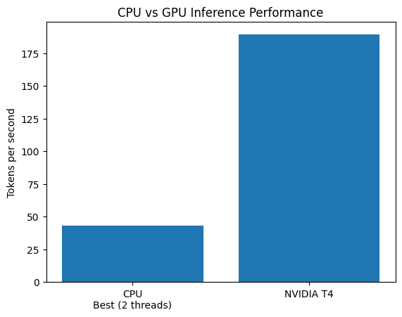
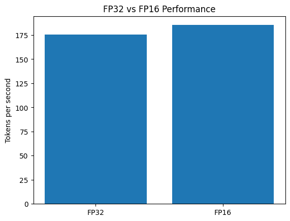
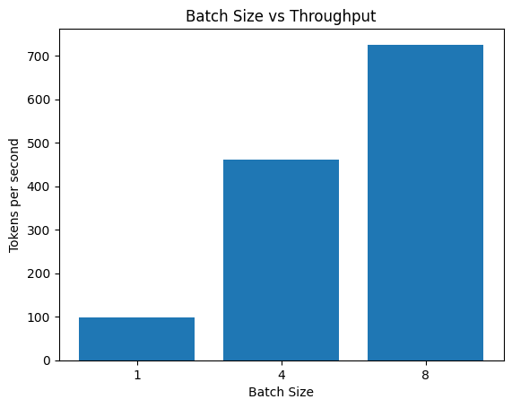

# GPU-Accelerated LLM Inference

## Project Goal

Make Large Language Model (LLM) inference faster and measure performance improvements using systematic benchmarking and optimization experiments.

## What I Built

I started with a small open-source LLM and measured how quickly it generates text on a CPU.

I then tested different configurations and optimization techniques, including:

- CPU thread tuning
- NVIDIA GPU acceleration
- FP16 precision
- INT8 quantization
- Batch inference
- Sequence-length testing
- `torch.compile()`
- GPU memory measurement
- GPU profiling

## How It Works

```text
User Prompt
     ↓
Tokenizer
     ↓
LLM
     ↓
CPU or GPU
     ↓
Generated Text
     ↓
Performance Measurement
```
### Baseline

Model: distilgpt2

Parameters: 81,912,576

Device: CPU

Baseline result:
```bash

Generated tokens: 30
Average time: 0.79 seconds
Tokens/second: 37.83
```
### CPU Thread Experiment

| Threads | Tokens/second |
| ------: | ------------: |
|       1 |         37.33 |
|       2 |     **42.88** |
|       4 |         34.75 |
|       8 |         35.06 |

### Finding

### 2 CPU threads gave the best result in this experiment: 42.88 tokens/second.

This showed that more CPU threads do not always mean faster LLM inference. Performance needs to be measured instead of assumed.

## NVIDIA GPU Benchmark

The same DistilGPT2 model was tested on an NVIDIA Tesla T4 GPU using CUDA.


### Results

| Configuration   | Tokens/second |
| --------------- | ------------: |
| CPU baseline    |         37.83 |
| CPU — 2 threads |         42.88 |
| NVIDIA Tesla T4 |    **189.22** |

The Tesla T4 achieved approximately 4.4× higher single-request throughput than the best CPU configuration tested.

### GPU Benchmark Details
```bash

GPU: NVIDIA Tesla T4
Generated tokens: 30
Average time: 0.1585 seconds
Tokens/second: 189.22
```
### FP16 Optimization

FP16 (16-bit floating point) was tested on the NVIDIA Tesla T4 to determine whether lower precision could improve inference performance and reduce GPU memory usage.

### FP32 vs FP16

| Precision | Tokens/second |    GPU Memory |
| --------- | ------------: | ------------: |
| FP32      |        175.67 |     481.85 MB |
| **FP16**  |    **185.33** | **329.24 MB** |

### Finding

In this experiment, FP16 achieved:

- ~5.5% higher throughput
- ~31.7% lower measured GPU memory usage

This showed that lower-precision computation can improve both performance and memory efficiency for this workload.

### INT8 Quantization Experiment

INT8 quantization was tested to determine whether reducing numerical precision would improve inference performance.

| Precision | Tokens/second |
| --------- | ------------: |
| **FP16**  |    **185.33** |
| INT8      |          7.27 |

### Finding

INT8 was significantly slower than FP16 in this experiment.

This demonstrates that quantization does not automatically improve inference speed; the implementation, hardware, model, and workload also affect performance.

### torch.compile() Experiment

`torch.compile()` was tested to determine whether model compilation improved FP16 inference performance.

| Configuration     | Tokens/second |
| ----------------- | ------------: |
| **FP16 baseline** |    **185.33** |
| `torch.compile()` |        184.26 |

### Finding

`torch.compile()` did not improve throughput for this specific model and workload.

This experiment reinforced the importance of measuring optimizations instead of assuming they will always improve performance.

### GPU Profiling

PyTorch Profiler was used to identify expensive GPU operations during FP16 inference on the Tesla T4.

### Top GPU Operations

| Operation     | CUDA Time |
| ------------- | --------: |
| `aten::addmm` | 18.053 ms |
| `aten::mm`    | 13.293 ms |

### Finding

Matrix multiplication operations were a major part of the GPU workload.

This profiling step helps identify where optimization effort should be focused instead of optimizing blindly.

### Batch Inference Benchmark

Batch inference was tested using FP16 on the NVIDIA Tesla T4.

Each configuration used:

- 3 warm-up runs
- 5 timed runs

| Batch Size | Tokens/second | Peak GPU Memory |
| ---------: | ------------: | --------------: |
|          1 |         98.73 |       169.06 MB |
|          4 |        461.00 |       172.24 MB |
|      **8** |    **725.59** |   **176.48 MB** |

### Finding

Increasing batch size significantly improved total throughput.

Batch size 8 achieved approximately 7.35× higher throughput than batch size 1 in this experiment.

GPU memory usage increased only modestly in the measured workload.

Note: Batch throughput measures total tokens generated across multiple requests and should not be directly compared with single-request latency or throughput measurements.

### Sequence Length Experiment

Inference performance was tested using different input sequence lengths.

| Prompt    | Input Tokens | Average Tokens/second |
| --------- | -----------: | --------------------: |
| **Short** |            4 |            **163.74** |
| Medium    |           72 |                125.11 |
| Long      |          282 |                138.83 |

### Finding

Inference throughput varied with input sequence length.

Repeated experiments showed that benchmark results can vary between runs, demonstrating why performance measurements should use multiple runs and averages instead of relying on a single benchmark.

## Performance Charts

### CPU vs GPU



### FP32 vs FP16



### Batch Size vs Throughput



## Final Results Summary

### CPU vs GPU

| Configuration          | Tokens/second |
| ---------------------- | ------------: |
| CPU baseline           |         37.83 |
| Best CPU configuration |         42.88 |
| NVIDIA Tesla T4        |    **189.22** |

### Precision

| Configuration | Tokens/second |
| ------------- | ------------: |
| FP32          |        175.67 |
| **FP16**      |    **185.33** |
| INT8          |          7.27 |

### Batch Throughput

| Batch Size | Tokens/second |
| ---------: | ------------: |
|          1 |         98.73 |
|          4 |        461.00 |
|      **8** |    **725.59** |

### Project Structure

```text
gpu-llm-inference/
│
├── benchmarks/
│   ├── baseline.txt
│   ├── first_profile.txt
│   ├── thread_results.txt
│   ├── gpu_t4_results.txt
│   ├── fp16_results.txt
│   ├── int8_results.txt
│   ├── batch_results.txt
│   ├── batch_memory_results.txt
│   ├── gpu_profile.txt
│   ├── compile_results.txt
│   ├── sequence_length_results.txt
│   └── final_report.txt
│
├── charts/
│   ├── cpu_vs_gpu.png
│   ├── fp32_vs_fp16.png
│   └── batch_throughput.png
│
├── baseline.py
├── llm_profile.py
├── thread_benchmark.py
├── README.md
└── .gitignore
```

### What I Learned
- What LLM inference means
- How to run an LLM locally
- How to measure inference speed
- What a performance baseline is
- How CPU threads affect inference
- How to benchmark different     configurations
- How GPU acceleration improves inference throughput
- How FP16 can improve performance and reduce memory usage
- How batch size affects throughput
- Why repeated benchmarks are important
- Why some optimizations do not improve every workload
- How GPU profiling helps identify expensive operations
- Why optimization should be based on measurements

### Project Philosophy

**Measure → Find the bottleneck → Optimize → Measure again → Keep what works**

## Next Steps
- Explore CUDA optimization techniques
- Investigate GPU matrix operation optimization
- Test additional models and workloads
- Compare optimization techniques across different hardware
- Build more advanced CUDA-level optimizations

### Status

## Status

🟢 CPU baseline completed  

🟢 CPU thread benchmarking completed  

🟢 NVIDIA T4 GPU benchmarking completed  

🟢 FP16 optimization experiment completed  

🟢 GPU memory analysis completed  

🟢 Batch inference benchmarking completed  

🟢 INT8 quantization experiment completed  

🟢 `torch.compile()` experiment completed  

🟢 Sequence-length experiment completed  

🟢 GPU profiling completed  

🟢 Final performance report completed  

🔵 CUDA-level optimization — next stage
